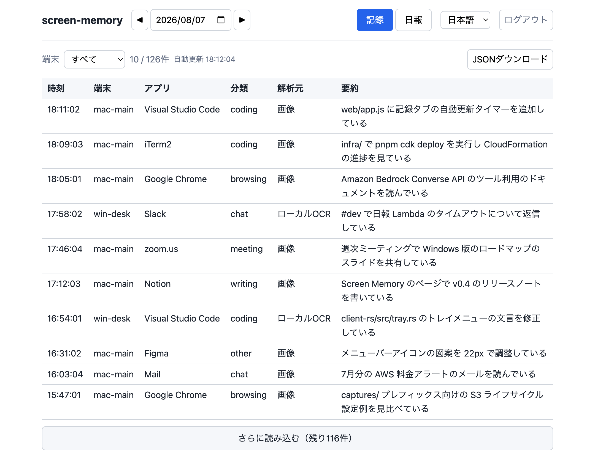

# Screen Memory

[English](README.md) | [日本語](README.ja.md)

Screen Memory は、作業中のウィンドウを1分ごとに静かに撮影し、その記録から AI が日報を書く個人用ツールです。
クラウドを使わず、すべてを手元のマシンに残して自分で解析する使い方もできます。

自分のマシンでクライアントを動かし、クラウド側も自分の AWS アカウントの中だけで完結します。
第三者のサーバーはなく、テレメトリもありません。

- macOS（メニューバー常駐）と Windows（通知領域常駐）
- クライアントは Rust 製。解析は Amazon Bedrock（Claude）
- 記録と日報を日付ごとに眺める小さな Web UI 付き



*記録タブの画面です。実際の記録ではなく、本物の UI にサンプルデータを流し込んで描画したものです。*

## インストール

[リリースページ](https://github.com/coni524/screen-memory/releases)から、macOS 版の DMG（ディスクイメージ）か Windows 版のインストーラーをダウンロードしてください。
どちらにも入っているのはクライアントだけです。AWS 側は自分のアカウントに自分でデプロイするもので、ローカル保存モードなら AWS そのものが要りません。

### macOS

DMG を開き、`Screen Memory.app` を Applications へドラッグします。
Developer ID 証明書で署名し Apple の公証（notarization）も通しているので、警告なしで開けます。
Applications から一度手で起動し、macOS が尋ねてきたら「システム設定 > プライバシーとセキュリティ > 画面収録」で許可し、いったん終了して開き直すと許可が反映されます。
ログイン時に自動起動させるには、「システム設定 > 一般 > ログイン項目」に追加してください。

### Windows

`screen-memory-setup-<バージョン>.exe` を実行します。
インストーラーは現在のユーザーだけに入れる形式で、管理者権限は不要です。ログオン時に自動起動するタスクもインストーラーが登録します。

このインストーラーにはコード署名がないため、SmartScreen（Windows の実行前検査）が「WindowsによってPCが保護されました」と表示します。
「詳細情報」から「実行」を選んでください。署名のないバイナリを実行したくない場合は、後述の手順で自分でビルドしてください。

## 3つのモード

何をマシンの外に出すかはモードで決まり、トレイのメニューでいつでも切り替えられます。

| モード | AWS へ送るもの | 用途 |
|---|---|---|
| AWS解析（画像を送信）（既定） | 画像（WebP）とメタデータ JSON | Bedrock が画像そのものを読むので解析の質が最も高い |
| AWS解析（文字を送信） | OCR テキスト入りメタデータ JSON | 画像を端末から出さずに日報を作る |
| ローカル保存（送信なし） | 何も送らない | AWS 無しで使う。OCR テキストを端末内の JSONL（日付ごと、1行1 JSON）に追記し、後から好きな LLM（Claude Code など）でまとめて解析する |

ローカル保存（送信なし）のモードなら、AWS のセットアップは不要で、クライアントを入れるだけで動きます。

## プライバシーへの配慮

- ほぼ同じ画面はスキップし、離席中は撮影を止めます。
- 特定のアプリを撮影対象から外せます（設定の `exclude_apps`。パスワードマネージャーなどに）。
- macOS では「画面収録」の許可が必要で、許可するまで何も撮影されません。
- AWS モードでも、データの行き先は自分のアカウントの S3 バケットだけで、Bedrock の呼び出しも自分のアカウント内で行われます。

## 自分でビルドする

配布バイナリを使わず、自分でクライアントをビルドする手順です。
ここには AWS は出てきません。ビルドして入れ、ローカル保存モードを選べば動きます。

### macOS

```bash
cd client-rs
packaging/build-app.sh adhoc
```

証明書不要のアドホック署名で `.app` ができ、残りの手順（/Applications への配置、画面収録の許可、ログイン時自動起動の登録）をスクリプトが表示します。
あとはメニューバーのアイコンからローカル保存モードを選ぶだけです。

アドホック署名は、ビルドし直すたびに署名が変わるので、macOS が画面収録の許可を取り直しにきます。
このとき設定画面のトグルは ON のままに見えますが、それは古いビルドへの許可の残骸で、新しいバイナリは未許可のまま撮影のたび（毎分）に macOS がダイアログを出し続けます。
トグルを入れ直しても直りません。
次のコマンドで残骸を消し、エージェントを起動し直してから、出てきたダイアログで許可してください。

```bash
launchctl bootout gui/$(id -u)/com.screen-memory.agent
tccutil reset ScreenCapture jp.troches.screen-memory
launchctl bootstrap gui/$(id -u) ~/Library/LaunchAgents/com.screen-memory.agent.plist
```

許可後にもう一度 1 行目と 3 行目でエージェントを再起動すると、許可が反映されます。
何度もビルドするなら、自己署名証明書を一度作って（作り方は `build-app.sh` 冒頭のコメント）引数なしでビルドすると、許可が引き継がれます。

### Windows

Windows 機の上でビルドします（Rust と Visual Studio Build Tools が必要）。

```powershell
cd client-rs
cargo build --release
```

`screen-memory.exe` を実行するとトレイに常駐します。
自動起動の登録は次で行います。

```powershell
powershell -ExecutionPolicy Bypass -File packaging\register-windows-task.ps1
```

## フルセットアップ（AWS 解析と日報、Web UI）

### 1. インフラのデプロイ

```bash
cd infra
pnpm install
pnpm cdk bootstrap   # アカウント未ブートストラップのときだけ
pnpm cdk deploy
```

デプロイ後の出力 `BucketName` `TableName` `ApiEndpoint` `UserPoolId` `UserPoolClientId` `IdentityPoolId` `CognitoDomain` `WebUrl` を控えます。

### 2. ユーザー作成（CDK では作らない手作業）

Cognito のユーザープールにユーザーを1人作ります。
アップロードと閲覧の両方に同じアカウントを使い、アクセスキーは発行しません。

```bash
aws cognito-idp admin-create-user --user-pool-id <UserPoolId> --username <名前> --temporary-password <仮パスワード>
```

### 3. クライアントの設定

トレイのメニュー「設定を開く…」が出す設定ウィンドウで入力します。
「接続チェック」ボタンで、Cognito 認証と S3 への書き込みを保存前に確かめられます。
ファイルで書くなら、macOS は `~/.config/screen-memory/config.toml`、Windows は `%APPDATA%\screen-memory\config.toml` を CDK の出力から作ります。

```toml
device_id = "mac-main"
bucket = "screen-memory-data-<アカウントID>"
region = "ap-northeast-1"
user_pool_id = "<UserPoolId>"
user_pool_client_id = "<UserPoolClientId>"
identity_pool_id = "<IdentityPoolId>"
cognito_domain = "<CognitoDomain>"
```

トレイのメニュー「ログイン」でブラウザの Cognito ログイン画面が開き、完了するとリフレッシュトークンが端末に保存されて以後は無人で更新されます。

### 4. 閲覧

ブラウザで `WebUrl` を開くと Cognito のログイン後に、日付ごとの記録と日報を閲覧できます。

## リポジトリ構成

| ディレクトリ | 内容 |
|---|---|
| `client-rs/` | キャプチャエージェント（Rust）。macOS と Windows |
| `lambdas/` | Lambda のソース（analyze / report / api） |
| `infra/` | CDK（TypeScript、pnpm）。AWS リソース一式を1スタックで定義 |
| `web/` | 閲覧用 Web UI（静的ファイル。CDK が S3 + CloudFront に配置） |

## リージョンについて

既定のリージョンは `ap-northeast-1`（東京）で、Bedrock のモデル ID は日本向けクロスリージョン推論プロファイル（接頭辞 `jp.`）を使っています。
他リージョンで使うときは、`infra/bin/infra.ts` のリージョンと `infra/lib/infra-stack.ts` のモデル ID 接頭辞をあわせて変えます。

## 署名と配布（macOS）

`build-app.sh` は3通りの署名に対応しています：`adhoc`（証明書不要）、自己署名証明書（既定。再ビルドしても画面収録の許可が残る）、配布用の「Developer ID Application」証明書。
`make-dmg.sh` はドラッグでインストールできる DMG を作り、Developer ID 証明書のときは公証（notarization）とチケット添付まで行います。

## 開発

- インフラのテスト：`cd infra && pnpm test`
- クライアントのテスト：`cd client-rs && cargo test`

## 言語

アプリの UI は日英対応です。
既定では OS の言語設定に従い、設定ウィンドウの「言語」でどちらかに固定もできます（反映はアプリの再起動後）。
記録の要約と日報は日本語で生成されます。
他の言語にしたい場合は `lambdas/analyze/prompts.py` と `lambdas/report/index.py` のプロンプトを書き換えてください。

## ライセンス

MIT ライセンスです。
全文は [LICENSE](LICENSE) にあります。
