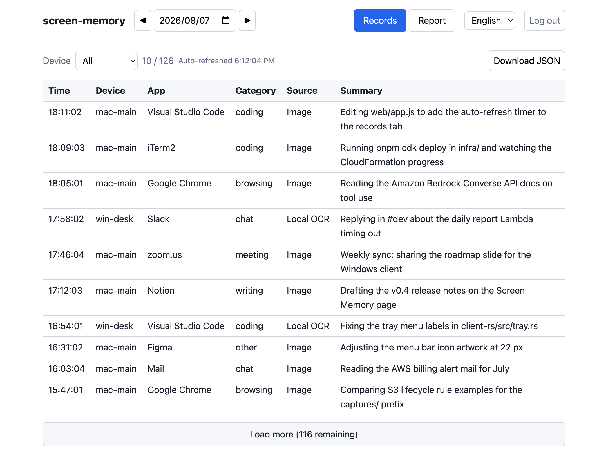

# Screen Memory

[English](README.md) | [日本語](README.ja.md)

Screen Memory quietly captures your active window once a minute and turns those captures into a daily work report, written by AI. If you prefer, it can instead keep everything on your machine and leave the analysis to you.

It is a personal tool: you run it on your own machines, and the optional cloud side runs entirely in your own AWS account. There is no third-party server and no telemetry.

- macOS (menu bar) and Windows (system tray)
- Client written in Rust; analysis powered by Amazon Bedrock (Claude)
- A small web UI to browse your records and daily reports



*The records tab. The screenshot is rendered from the real UI with sample data, not from an actual capture. Summaries and daily reports are generated in Japanese by default; see [Language](#language).*

## Install

Download the latest macOS DMG or Windows installer from the [releases page](https://github.com/coni524/screen-memory/releases). Both contain the client only; the AWS side is something you deploy into your own account, and local mode needs none of it.

### macOS

Open the DMG and drag `Screen Memory.app` into Applications. The app is signed with a Developer ID certificate and notarized by Apple, so it opens without a warning. Launch it once from Applications, grant it Screen Recording under System Settings > Privacy & Security when macOS asks, then quit and reopen the app so the permission takes effect. To start it at login, add it under System Settings > General > Login Items.

### Windows

Run `screen-memory-setup-<version>.exe`. It installs for the current user only, needs no administrator rights, and registers a scheduled task so the app starts at logon.

The installer carries no code signature, so SmartScreen shows "Windows protected your PC". Choose "More info" and then "Run anyway", or build from source if you would rather not trust an unsigned binary.

## Three modes

You choose how much leaves your machine, and you can switch at any time from the tray menu.

| Mode | What is uploaded | Good for |
|---|---|---|
| AWS analysis, sending images (default) | WebP screenshots and metadata JSON | Best analysis quality: Bedrock reads the images themselves |
| AWS analysis, sending text | Metadata JSON with on-device OCR text | Keeping images on your machine while still getting daily reports |
| Local only, no upload | Nothing | Using it without AWS at all. OCR text is appended to daily JSONL files on your machine, which you can analyze later with any LLM (Claude Code works nicely) |

In local mode, no AWS setup is needed: install the client and you are done.

## Privacy notes

- Capture skips near-duplicate frames and pauses while you are idle.
- You can exclude specific apps from capture (`exclude_apps` in the config), for example password managers.
- On macOS the app needs the Screen Recording permission; nothing is captured until you grant it.
- In the AWS modes, data goes only to an S3 bucket in your own account, and Bedrock is called inside your account as well.

## Build from source

If you would rather build the client yourself than run a downloaded binary. Nothing here needs AWS: build, install, and pick local mode.

### macOS

```bash
cd client-rs
packaging/build-app.sh adhoc
```

This builds a `.app` bundle with an ad-hoc signature (no certificate needed) and prints the remaining steps: copy it to `/Applications`, grant the Screen Recording permission, and register the launch agent so it starts at login. Then pick the local mode from the menu bar icon.

One caveat of ad-hoc signing: each rebuild produces a new signature, so macOS asks for the Screen Recording permission again. After a rebuild the toggle in System Settings still looks ON, but that entry is a leftover bound to the old build; the new binary stays unauthorized and macOS shows the permission dialog on every capture (every minute). Toggling the entry off and on does not fix it. Remove the stale entry and restart the agent, then grant the permission in the dialog that appears:

```bash
launchctl bootout gui/$(id -u)/com.screen-memory.agent
tccutil reset ScreenCapture jp.troches.screen-memory
launchctl bootstrap gui/$(id -u) ~/Library/LaunchAgents/com.screen-memory.agent.plist
```

After granting, run lines 1 and 3 once more to restart the agent so the permission takes effect. If you plan to rebuild often, create a self-signed code-signing certificate once (see the comments at the top of `build-app.sh`) and the permission carries over.

### Windows

Build on a Windows machine (Rust and the Visual Studio Build Tools are required):

```powershell
cd client-rs
cargo build --release
```

Run `screen-memory.exe` for the tray app, and register autostart with:

```powershell
powershell -ExecutionPolicy Bypass -File packaging\register-windows-task.ps1
```

## Full setup (AWS analysis, daily reports, and the web UI)

### 1. Deploy the infrastructure

```bash
cd infra
pnpm install
pnpm cdk bootstrap   # only if the account is not bootstrapped yet
pnpm cdk deploy
```

Note the stack outputs: `BucketName`, `TableName`, `ApiEndpoint`, `UserPoolId`, `UserPoolClientId`, `IdentityPoolId`, `CognitoDomain`, `WebUrl`.

### 2. Create a user (manual, not managed by CDK)

Create a user in the Cognito user pool. The same account is used for uploading and for browsing; no access keys are issued.

```bash
aws cognito-idp admin-create-user --user-pool-id <UserPoolId> --username <name> --temporary-password <temp-password>
```

### 3. Configure the client

Open the settings window from the tray menu ("設定を開く…" / Open Settings). It has a connection check button that verifies Cognito sign-in and S3 write access before saving. If you prefer a file, write `~/.config/screen-memory/config.toml` (macOS) or `%APPDATA%\screen-memory\config.toml` (Windows) using the CDK outputs:

```toml
device_id = "mac-main"
bucket = "screen-memory-data-<account-id>"
region = "ap-northeast-1"
user_pool_id = "<UserPoolId>"
user_pool_client_id = "<UserPoolClientId>"
identity_pool_id = "<IdentityPoolId>"
cognito_domain = "<CognitoDomain>"
```

Then choose "Login" in the tray menu; a browser window opens for Cognito sign-in, and the refresh token is stored locally so you stay signed in.

### 4. Browse

Open `WebUrl` in a browser. After Cognito sign-in you can browse records and daily reports by date.

## Repository layout

| Directory | Contents |
|---|---|
| `client-rs/` | Capture agent (Rust) for macOS and Windows |
| `lambdas/` | Lambda sources (analyze / report / api) |
| `infra/` | CDK (TypeScript, pnpm); the whole AWS side in one stack |
| `web/` | Static web UI, deployed to S3 + CloudFront by the CDK |

## Notes for the region

The default region is `ap-northeast-1` (Tokyo), and the Bedrock model ID uses the `jp.` cross-region inference profile. If you deploy elsewhere, change the region in `infra/bin/infra.ts` and the model ID prefix in `infra/lib/infra-stack.ts` together.

## Signing and distribution (macOS)

`build-app.sh` supports three signing options: `adhoc` (no certificate), a self-signed certificate (default, keeps the screen-recording permission across rebuilds), and a "Developer ID Application" certificate for public distribution. `make-dmg.sh` builds a drag-to-install DMG, and with a Developer ID certificate it also notarizes and staples the image.

## Development

- Infrastructure tests: `cd infra && pnpm test`
- Client tests: `cd client-rs && cargo test`

## Language

The app UI is bilingual: it follows the OS language (Japanese or English) by default, and you can force either language from the settings window (the change applies after a restart). Record summaries and daily reports are generated in Japanese; edit the prompts in `lambdas/analyze/prompts.py` and `lambdas/report/index.py` if you want another language.
